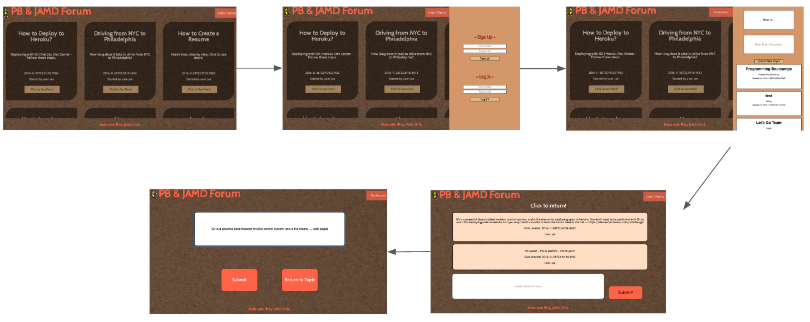
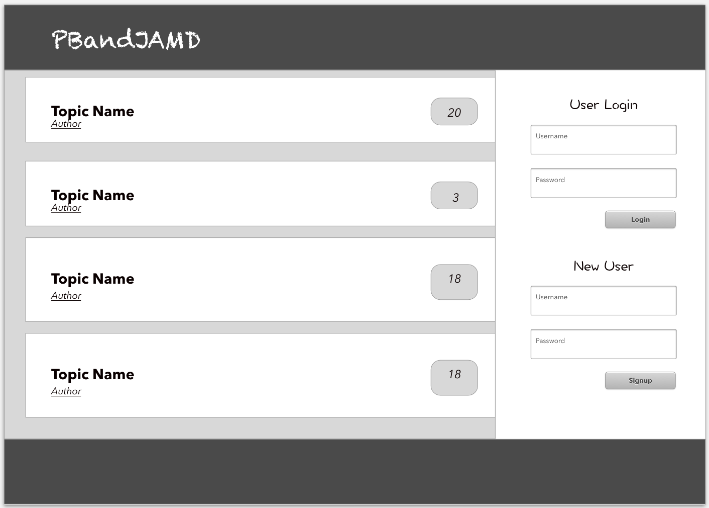
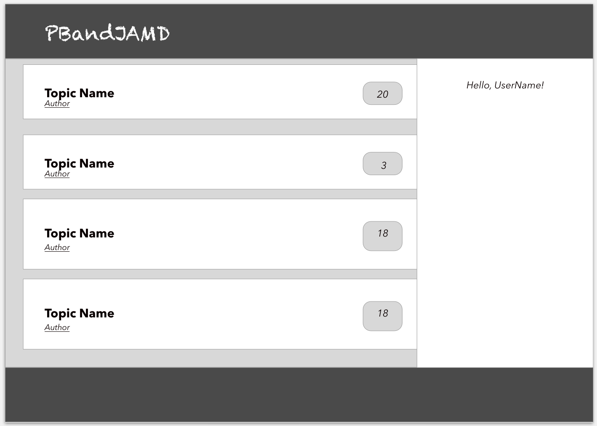
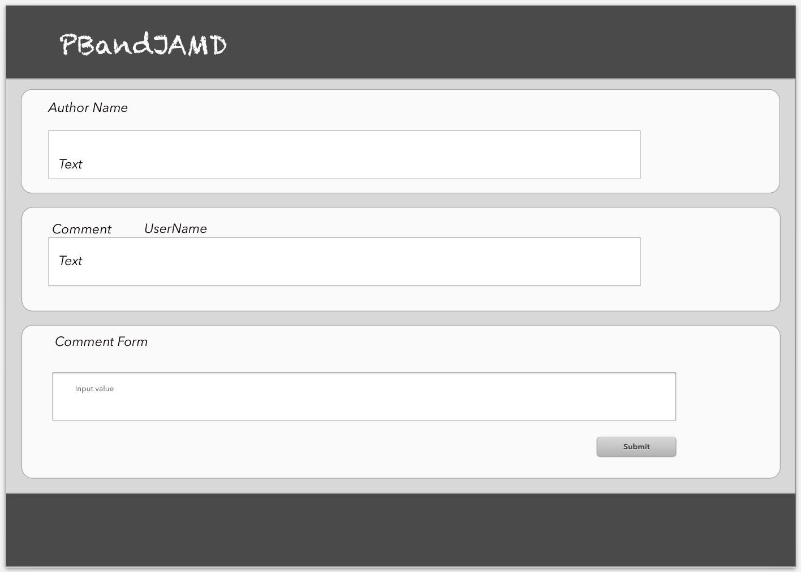
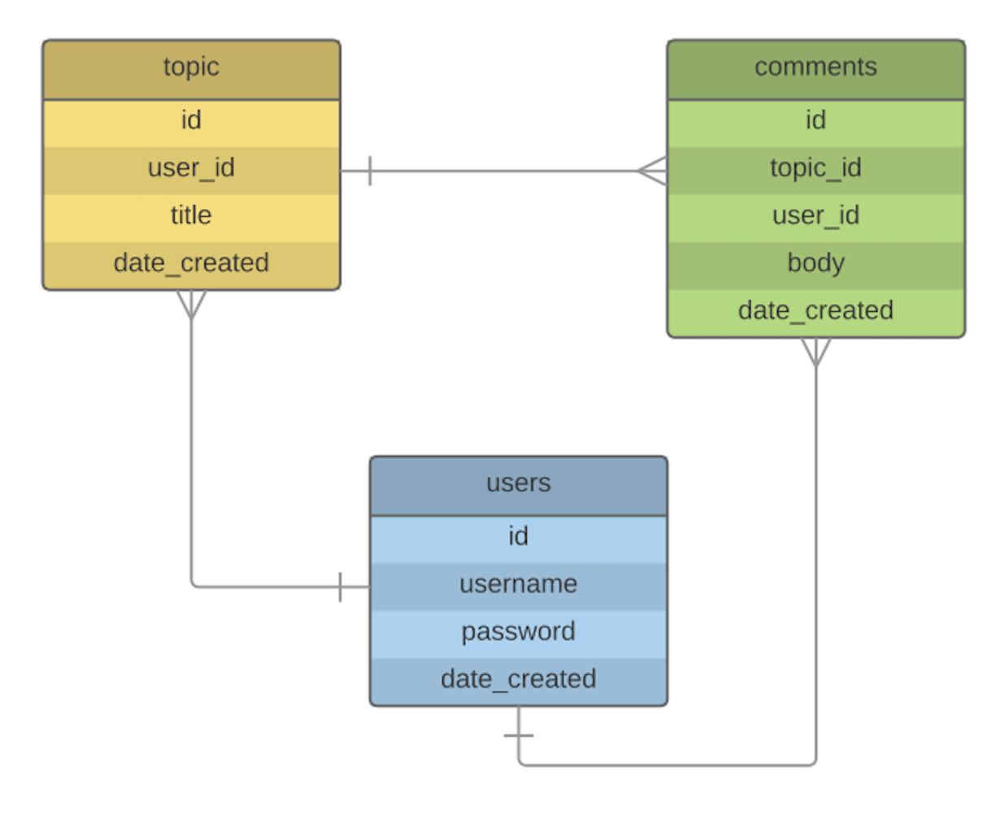

# PBandJAMD Forum/Chatroom

## Description / User Story
We want to make a forum application that allows users to post topics that they are interested in, for example, a certain coding topic that they need help with or a specific assignment. However, the forum is intended for any topics that are of interest to our users. We want to create mini "chatrooms" in each topic, similar to a forum, but live so that the page constantly updates when new posts are submitted encouraging a more active chatroom. Once users sign up, they have the ability to view, create, update, and delete any topics/comments. If you or a user answers someone’s question, the information can be referenced and accessed by other users. This forum will encourage all users to share their ideas/information

## User Flow

## Wireframes

## Main Technologies
- Javascript
- React
- Node.js
- Express
- PSQL
- HTML
- CSS

## ERDs

### Group Members
Jaemin Han, Alexander Tong, Mohamed Gassama and Damira Ibragimova

### Help Used:
1. https://scotch.io/tutorials/build-a-react-flux-app-with-user-authentication
2. http://stackoverflow.com/questions/34184020/react-native-how-to-switch-page-without-using-navigatorios-component
3. Login Form Fetch Function - Bobby King’s React Puppies Solution with Auth - https://git.generalassemb.ly/wdi-nyc-60/react-puppies-solution
4. http://stackoverflow.com/questions/31023308/clearinterval-is-not-working-in-reactjs
5. Images - https://pixabay.com/
